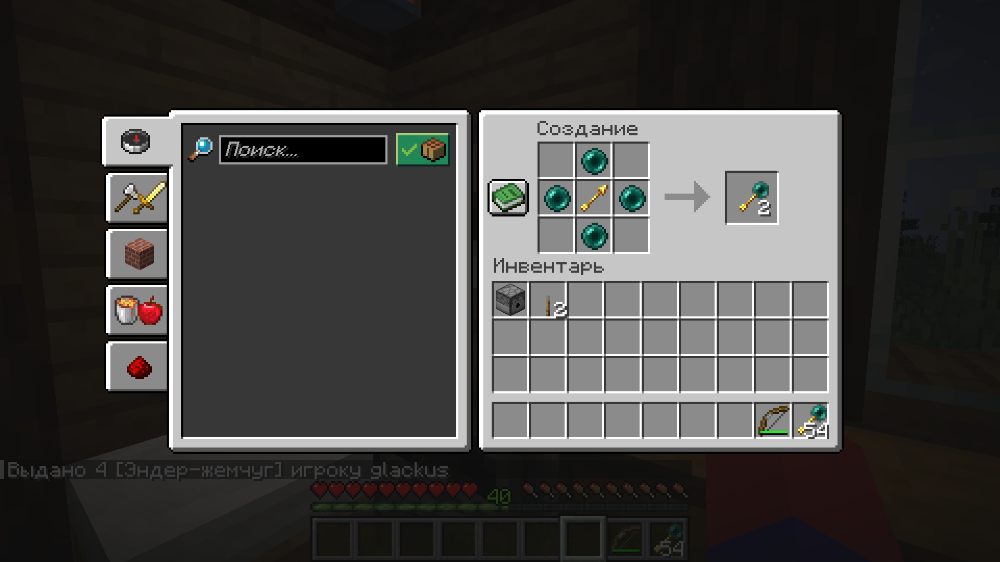
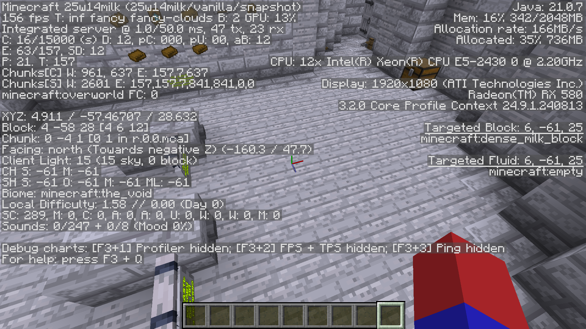
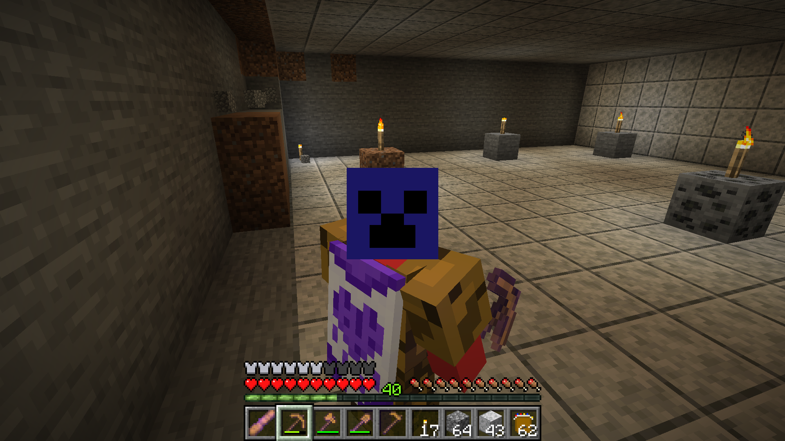
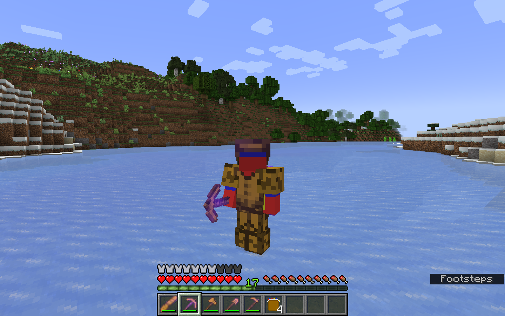

---

# LighSync Games. Minecraft 25w14milk!
### © LighSync Games. 2023-2026.

---

# Русский (РУ)

---

> Время проснуться! От конвеерных модов, тысячных сборок, загрузчиков и этих сложностей. Мы представляем вам полное внедрение в код Minecraft!
> Ещё никто в мире Minecraft этого не делал! Мы представляем вам иновационный: Minecraft 25w14milk!

---

## 🔥 Что это?
**Minecraft 25w14milk** - это не мод, не датапак, не ресурп-пак.
Это **изменённый исходный код оригинального Minecraft**.

> 💥 Впервые за историю Minecraft - полный контроль над игровым ядром. Как vanilla!

---

## 🚀 Особенности

- 🧠 **Собственный билд ядра** Minecraft. +к скорости
- 🔥 **Новые блоки, сущности, системы освещения** - всё через реальный код Minecraft!
- ⚙  **Никаких Forge/Fabric/Quilt** - мы не модифицируем игру, мы **ею становимся**
- 🌐 **Интеграция ИИ** - интеграция нашей собственной ИИ-модели (LighSync Gemini), позволяет вам получить ответ на интересующий вопрос не выходя из игры
- 🎮 Всё, что происходит - полностью наше. Без ограничений.

---

## 👀 Скриншоты

 
 

---

## 📦 Установка

1. Загрузите архив на этой странице, или [тут](https://nogai3.github.io/LighSync/v1/downloads) и распакуйте его по пути: Win+R -> %appdata% -> .minecraft -> versions
2. Откройте лаунчер, создайте новую установку, как версию выберите 25w14milk, если не отображается - включите отображение снапшотов
3. Запускайте игру, загрузятся дополнительные ассеты с серверов Mojang Studios (для старых версий), или с серверов LighSync Games (для новых версий)

---

## 🌍 Команда LighSync

- 💡 Идея: Глеб Устименко (nogai3, glackus).
- 👨‍💻 Код: Глеб Устименко (nogai3, glackus).
- 🎨 Дизайн: 
    - Глеб Устименко (nogai3, glackus), 
    - Злата Устименко (wandarmo), 
    - Платон Унтеров (kartoha, PLYTONI), 
    - Константин Фадеев (KAPITANKASTET)
- 🐐 Вдохновение: [Nerkin](https://www.youtube.com/watch?v=bON1srkJzec), [Minecraft снапшоты на первое апреля!](https://minecraft.wiki/w/April_Fools%27_Day_jokes)

---

## 💬 Контакты

- 🧠 Discord: [тута](https://discord.gg/mrhQ2B8jD8)
- 📸 Телеграм-канал: [тута](https://t.me/lighsync)
- 🌐 Сайт: [тута](https://nogai3.github.io/LighSync)

---

# English (EN)

---

> Time to wake up! From convection mods, thousandth builds, downloaders and those complexities. We present you a complete implementation of Minecraft code!
> No one in the world of Minecraft has ever done this before! We present to you the innovative: Minecraft 25w14milk!

---

## 🔥 What is it?
**Minecraft 25w14milk** - it's not a mod, it's not a datapack, it's not a resource pack.
It`s **modified source code of the original Minecraft**.

> 💥 For the first time in the history of Minecraft - full control over the game core. Like vanilla!

---

## 🚀 Features

- 🧠 **Own kernel build** Minecraft. +to the speed
- 🔥 **New blocks, entities, lighting systems** - all through the actual Minecraft code!
- ⚙  **There`s no Forge/Fabric/Quilt** - we don't modify the game, **we become it.**
- 🌐 **AI integration** - integration of our own AI model (LighSync Gemini) allows you to get answers to your questions without leaving the game
- 🎮 Everything that's going on - is all ours. No restrictions.

---

## 👀 Screenshots

 
 

---

## 📦 Install

1. Download the archive on this page, or [here](https://nogai3.github.io/LighSync/v1/downloads) and unpack it to the following path: Win+R -> %appdata% -> .minecraft -> versions
2. Open Launcher, create a new installation, select 25w14milk as the version, if it is not displayed - enable snapshot displaying
3. Start the game, additional assets from Mojang Studios servers will be loaded (for legacy version's) or loaded from LighSync Games servers (for newest versions)

---

## 🌍 LighSync Team

- 💡 Idea: Gleb Ustimenko (nogai3, glackus).
- 👨‍💻 Code: Gleb Ustimenko (nogai3, glackus).
- 🎨 Design: 
    - Gleb Ustimenko (nogai3, glackus), 
    - Zlata Ustimenko (wandarmo), 
    - Platon Unterov (kartoha, PLYTONI), 
    - Konstantin Fadeev (KAPITANKASTET)
- 🐐 Inspiration: [Nerkin](https://www.youtube.com/watch?v=bON1srkJzec), [Minecraft April Fools Snapshots!](https://minecraft.wiki/w/April_Fools%27_Day_jokes)

---

## 💬 Our contacts

- 🧠 Discord: [here!](https://discord.gg/mrhQ2B8jD8)
- 📸 Telegram-channel: [here!](https://t.me/lighsync)
- 🌐 Site: [here!](https://nogai3.github.io/LighSync)
